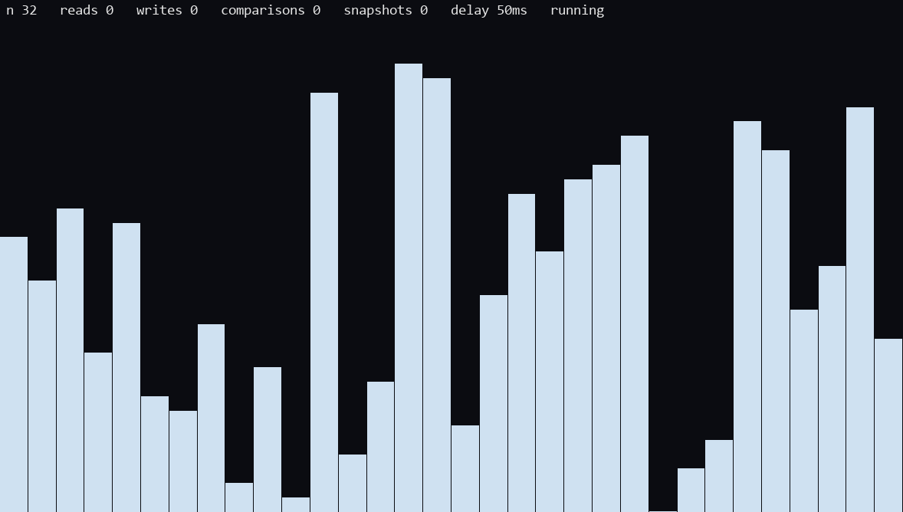
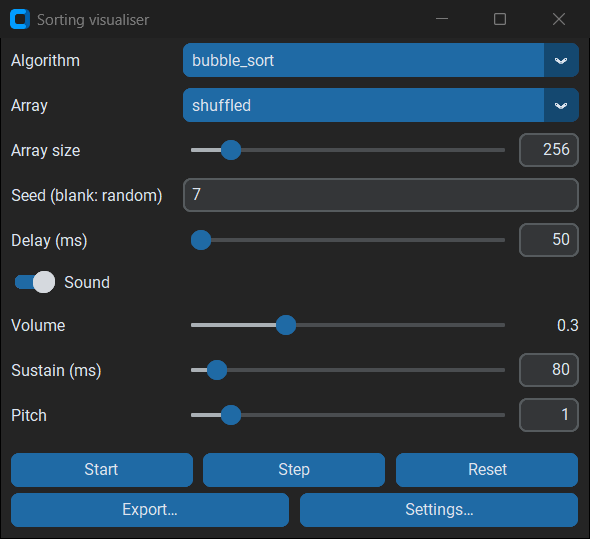
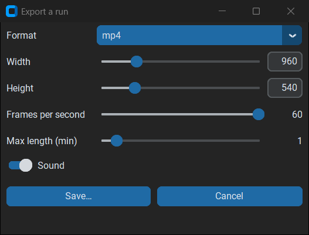
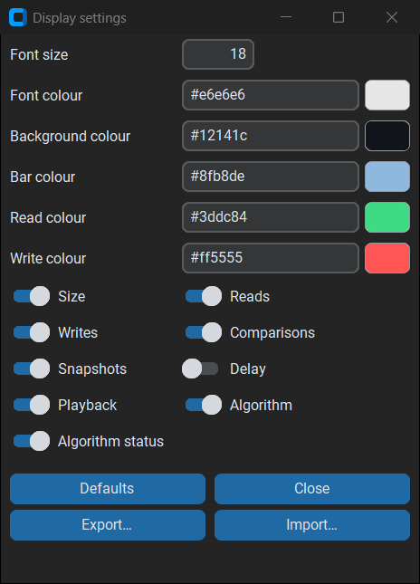

# Sorting algorithms visualiser

Visualise sorting algorithms with sound.
A Python take on [The Sound of Sorting](https://panthema.net/2013/sound-of-sorting/).

## Demo



[Merge sort (mp4)](demo/merge_sort.mp4) · [Tim sort, n = 546 (mp4)](demo/tim_sort_n_546.mp4)

## Features

* 22 algorithms, plus write your own (see [`src/algorithms/README.md`](src/algorithms/README.md))
* Customize everything: colors, font size, sound, array size/distribution, on-screen counters
* Export mp4/gif
* Import/export settings



The settings and the transport buttons. Start / Pause runs the algorithm, Step
advances one snapshot, Reset builds a fresh array.

|  |  |
| --- | --- |
| **Export…** | **Settings…**  |

## Requirements

* Python 3.11 or newer
* Tk — bundled with the python.org installers on Windows and macOS; on Debian or
  Ubuntu install `python3-tk` separately

## Installation

With [uv](https://docs.astral.sh/uv/), which creates the virtualenv for you:

```sh
uv sync
```

For development, add the extra tooling and the git hooks:

```sh
uv sync --extra dev
uv run pre-commit install
```

<details>
<summary>With pip and a manual virtualenv</summary>

```sh
python -m venv .venv
.venv\Scripts\activate      # Windows;  source .venv/bin/activate  elsewhere
pip install .
```

For development, install the extra tooling and the git hooks as well:

```sh
pip install -e ".[dev]"
pre-commit install
```

</details>

## Running

With uv, straight from a checkout:

```sh
uv run sortvis
```

After `pip install .`, in an activated virtualenv:

```sh
sortvis
```

From a checkout, without installing:

```sh
python src/gui.py
```

On Windows, double-clicking `src/main.pyw` starts it without a console window.

Two windows open: the **configurator** shown above, and the pygame window that
draws the array.
